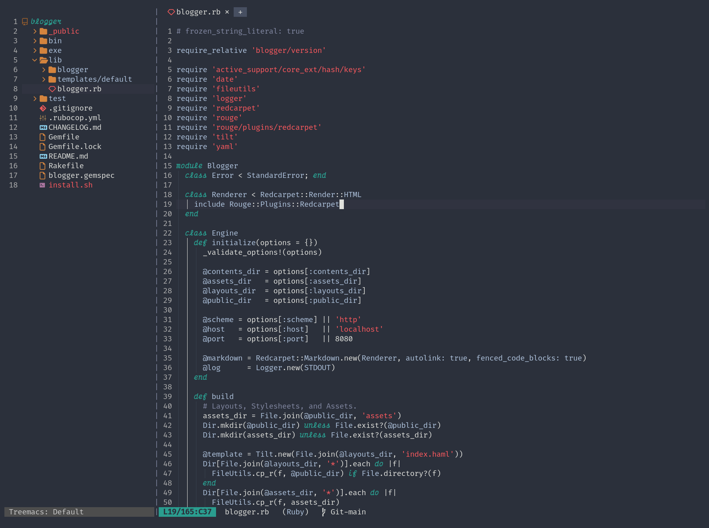

# Dark Weather Theme

A dark theme inspired by weather when it goes dark.



Currently only available for Emacs. PRs are welcome.

## Installation

### Emacs

> This is a git-based installation. Since the package is not on MELPA yet.

1. Clone the repo:

```sh
$ git clone https://github.com/sarans21/dark-weather-theme.git ~/.config/emacs/themes/
$ # Alternatively, just download the dark-weather-theme.el and put in ~/.config/emacs/themes/
```

2. Add custom theme directory to load path (if not already added) and load the theme:

```elisp
;; init.el
(add-to-list 'custom-theme-load-path "~/.config/emacs/themes/")
(load-theme 'dark-weather t)
```

3. That's it.

## LICENSE

MIT.
